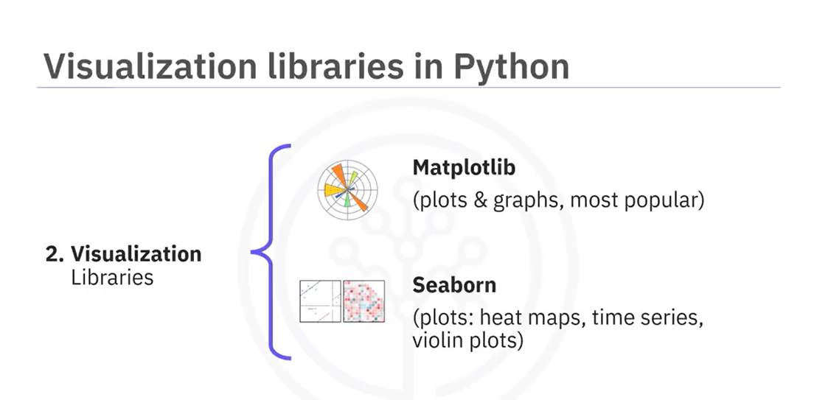

# IBMProfessionalCertDataSceience

### Data Analysis with Python

### EXPORT to different formats
|Data Format|Read|Save|
|----------|----|-----|
|csv|pandas.read_csv()|df.to_csv()|
|json|pandas.read_json()|df.to_json()|
|excel|pandas.read_excel()|df.to_excel()|
|sql|pandas.read_sql()|df.to_sql()|

### Data Visualization commands in Python
#### a. matplotlib
import matplotlib.pyplot as plt
from matplotlib import pyplot as plt
%matplotlib inline

|matplotlib functions|Syntax|
|-------------|-----------------|
|Standard line plot|plt.plot(x,y)|
|Scatter plot|plt.scatter(x,y)|
|Histogram|plt.hist(x,bins)|
|Bar plot|plt.bar(x,height)|
|Pseudo Color Plot|plt.pcolor(C)|

import seaborn as sns
|seaborn functions|Syntax|
|-------------|-----------------|
|Regression plot|sns.regplot(x = 'header_1',y = 'header_2',data= df)|
|Box and whisker plot|A box plot (or box-and-whisker plot) shows the distribution of quantitative data in a way that facilitates comparisons between variables or across levels of a categorical variable. The box shows the quartiles of the dataset while the whiskers extend to show the rest of the distribution, except for points that are determined to be "outliers".|
|Residual Plot|sns.residplot(data=df,x='header_1', y='header_2') \ sns.residplot(x=df['header_1'], y=df['header_2'])|
|KDE plot AKA Kernel Density Estimate (KDE) plot |sns.kdeplot(X)|
|Distribution Plot|sns.distplot(X,hist=False)|

### Model Development Lesson Summary
Congratulations! You have completed this lesson. At this point in the course, you know: 

**Linear regression** refers to using one independent variable to make a prediction.

You can use **multiple linear regression** to explain the relationship between **one continuous target y variable** and **two or more predictor x variables**.

Simple linear regression, or **SLR**, is a method used to understand the relationship between two variables, the **predictor independent variable x** and the target **dependent variable y**.

Use the **regplot** and **residplot** functions in the **Seaborn** library to create regression and residual plots, which help you identify the strength, direction, and linearity of the relationship between your independent and dependent variables.

When using **residual** plots for model evaluation, residuals should ideally have **zero mean**, appear **evenly distributed** around the x-axis, and have consistent variance. If these conditions are not met, consider adjusting your model.

Use **distribution** plots for models with **multiple** features: Learn to construct distribution plots to compare predicted and actual values, particularly when your model includes more than one independent variable. Know that this can offer deeper insights into the accuracy of your model across different ranges of values.

The order of the **polynomials** affects the fit of the model to your data. Apply Python's **polyfit** function to develop **polynomial regression models** that suit your specific dataset.

To prepare your data for more accurate modeling, use feature transformation techniques, particularly using the preprocessing library in **scikit-learn**, transform your data using **polynomial** features, and use the modules like **StandardScaler** to normalize the data.

**Pipelines** allow you to simplify how you perform transformations and predictions sequentially, and you can use pipelines in scikit-learn to streamline your modeling process.

You can construct and train a pipeline to automate tasks such as normalization, polynomial transformation, and making predictions.

To determine the fit of your model, you can perform sample evaluations by using the **Mean Square Error (MSE)**, using Python’s **mean_squared_error** function from **scikit-learn**, and using the score method to obtain the **R-squared value**.

**A model with a high R-squared value close to 1 and a low MSE is generally a good fit**, whereas a model with a low R-squared and a high MSE may not be useful.

Be alert to situations where your **R-squared value might be negative**, which can indicate **overfitting**. 

When evaluating models, use **visualization and numerical** measures and compare different models.

The **mean square error** is perhaps the most intuitive numerical measure for determining whether a model is good.

A **distribution** plot is a suitable method for multiple linear regression.

An acceptable **r-squared value** depends on what you are studying and your use case.

To evaluate your model’s fit, apply visualization, methods like regression and residual plots, and numerical measures such as the model's coefficients for sensibility: 

Use **Mean Square Error (MSE)** to measure the average of the squares of the errors between actual and predicted values and **examine R-squared** to understand the proportion of the variance in the dependent variable that is predictable from the independent variables.

When analyzing residual plots, residuals should be randomly distributed around zero for a good model. In contrast, a residual plot curve or inaccuracies in certain ranges suggest non-linear behavior or the need for more data.

AI coach:
Key Components: In linear regression, ( m ) represents the slope of the line (the coefficient), which indicates how much ( y ) changes for a unit change in ( x ). ( c ) is the y-intercept, which is the value of ( y ) when ( x ) is zero.

Target and Independent Variables: The target variable ( y ) is what you are trying to predict, while ( x ) (or multiple ( x ) values in multiple linear regression) are the features or predictors.

Model Fitting: The goal of linear regression is to find the best-fitting line through the data points, which minimizes the difference between the observed values and the values predicted by the model. This is often done using a method called "least squares."

In a well-fitted linear regression model, the residuals (the differences between the observed values and the predicted values) should not show any discernible pattern when plotted against the predicted values. This randomness indicates that the model has captured the underlying relationship in the data well, and any remaining variation is due to random noise.

If the residuals show a pattern, it may suggest that the model is not adequately capturing the relationship, and you might need to consider a more complex model or check for other issues like non-linearity.

### Cheat Sheet: Model Development

|Process | Description | COde Example|
|---|---|---|
|Linear Regression|Create a Linear Regression model object|from sklearn.linear_model import LinearRegression
lr = LinearRegression()|
|Train Linear Regression model Model|Train the Linear Regression model on decided data, separating Input and Output attributes. When there is single attribute in input, then it is simple linear regression. When there are multiple attributes, it is multiple linear regression.|X = df[[‘attribute_1’, ‘attribute_2’, ...]]
Y = df['target_attribute']
lr.fit(X,Y)|

